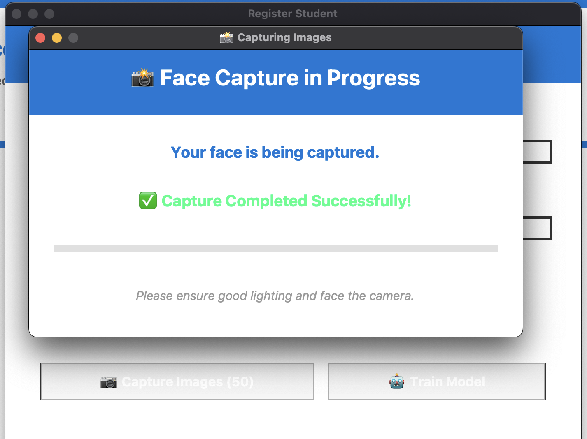
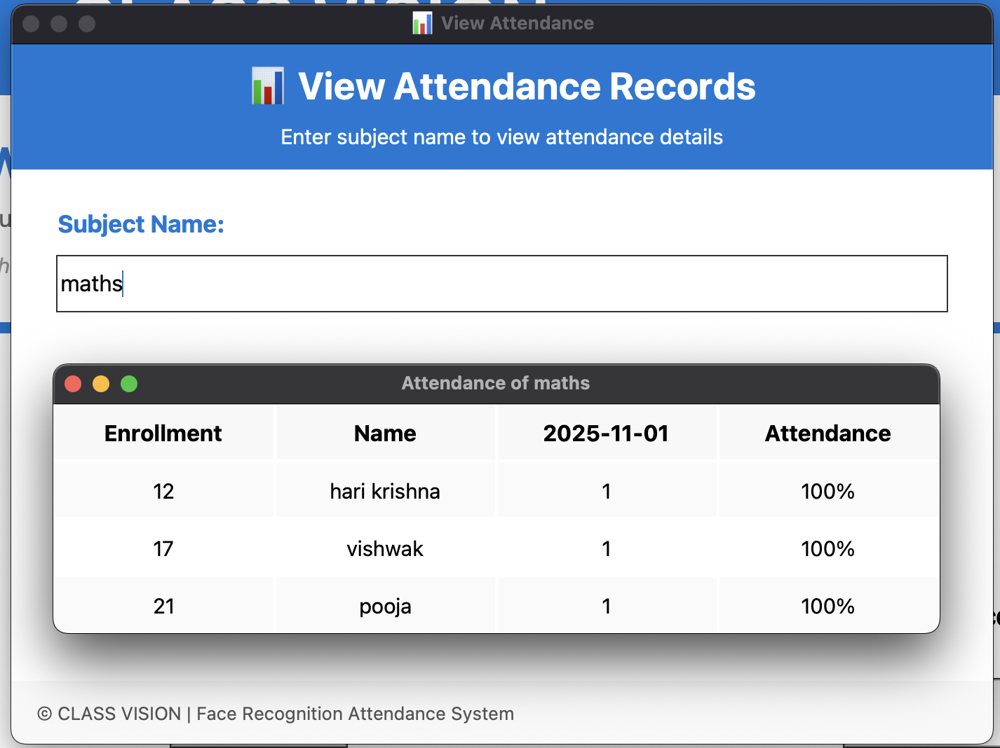

# 📸 Automated Face Recognition Attendance System

[](https://www.python.org/)
[](https://www.python.org/downloads/release/python-390/)
[](https://opensource.org/licenses/MIT)

An intelligent face recognition-based attendance system built with Python and OpenCV. This system automatically detects and recognizes faces to mark attendance, eliminating manual processes and preventing proxy attendance.

---

## ✨ Features

- 🧍 **Face Registration**: Register student faces with ID and name
- 📸 **Automated Image Capture**: Capture 50 face images per student for training
- 🤖 **ML Model Training**: Convert images to numeric format for face recognition
- 📋 **Automatic Attendance**: Mark attendance by recognizing faces in real-time
- 📊 **Attendance Viewing**: View attendance records in tabular format
- 💾 **Subject-wise Records**: Separate CSV files for each subject
- 🎨 **Modern UI**: Clean and intuitive graphical interface

---

## 🚀 Quick Start

### Prerequisites
- Python 3.9 or higher
- Webcam/Camera
- Git (optional, for cloning)

### Installation Steps

1. **Clone or Download the Repository**
   ```bash
   git clone https://github.com/vishwaksen21/Automated-attendance.git
   cd Automated-attendance
   ```

2. **Install Required Packages**
   ```bash
   pip install -r requirements.txt
   ```

3. **Create Training Folder**
   ```bash
   mkdir TrainingImage
   ```

4. **Update File Paths (if needed)**
   - Open `attendance.py` and `automaticAttendance.py`
   - Update folder paths according to your system if necessary

5. **Run the Application**
   ```bash
   python attendance.py
   ```

---

## 📖 Project Flow & Explanation

### Step 1: Register Student
- Click on **Register Student** button from the main dashboard
- A registration window will open

### Step 2: Enter Details
- Enter your **Enrollment Number** (ID)
- Enter your **Student Name**
- Click the **Capture Images (50)** button

### Step 3: Capture Face Images
- A camera window will pop up
- The system will automatically detect your face
- Up to 50 images will be captured and stored in the `TrainingImage` folder
- **Note**: More images = Better accuracy for recognition

### Step 4: Train Model
- Click the **Train Model** button
- The system converts all captured images into numeric format
- This allows the computer to understand and recognize your face patterns
- **Processing time depends on your system specifications**

### Step 5: Mark Attendance
- Click **Take Attendance** button
- Enter the subject name
- The system will recognize faces in real-time and mark attendance
- Generates a CSV file for the subject

### Step 6: View Attendance
- Click **View Attendance** button
- Enter the subject name
- View attendance records in a clean tabular format with attendance percentages

---

## 📁 Project Structure

```
Automated-attendance/
├── attendance.py                 # Main application entry point
├── automaticAttendance.py       # Automatic attendance module
├── show_attendance.py           # Attendance viewing module
├── takeImage.py                 # Image capture module
├── trainImage.py                # Model training module
├── TrainingImage/               # Captured face images (auto-created)
├── TrainingImageLabel/          # Trained model files
│   └── Trainner.yml             # Trained model
├── Attendance/                  # Subject-wise attendance records
├── StudentDetails/              # Student registration database
├── requirements.txt             # Python dependencies
└── README.md                    # This file
```

---

## 🛠️ Technologies Used

- **Python 3.9+** - Primary programming language
- **OpenCV** - Computer vision and face detection
- **TensorFlow/Keras** - Deep learning model training
- **Tkinter** - GUI framework
- **Pandas** - Data manipulation and CSV handling
- **NumPy** - Numerical computing

---

## 📊 Screenshots

### Dashboard


### Image Capture


### Attendance View


---

## ⚙️ Configuration

### Adjust Number of Images Captured
Edit the image count in `takeImage.py`:
```python
sample_num = 50  # Change this value to capture more or fewer images
```

### Change Face Detection Cascade
The system uses Haar Cascade classifiers. You can switch between:
- `haarcascade_frontalface_default.xml` (Recommended for general use)
- `haarcascade_frontalface_alt.xml` (Alternative)

---

## 📝 Usage Tips

1. **Better Lighting**: Ensure good lighting conditions during face capture for better accuracy
2. **Multiple Angles**: Capture images from various angles and distances for robust training
3. **Clear Face**: Keep your face clearly visible without obstructions (glasses/masks affect accuracy)
4. **Regular Updates**: Re-train the model if you change your appearance significantly
5. **Backup Data**: Backup your `TrainingImage` and attendance CSV files regularly

---

## 🐛 Troubleshooting

### Issue: "No attendance records found"
- Ensure the subject folder exists in the `Attendance` directory
- Check that CSV files are created in the correct subject folder

### Issue: Face not being detected
- Ensure adequate lighting
- Move closer to the camera
- Try removing glasses or obstructions

### Issue: Poor attendance accuracy
- Capture more training images (50+ recommended)
- Retrain the model
- Ensure consistent lighting conditions

### Issue: Camera not detected
- Check webcam permissions
- Restart the application
- Try a different USB port (if using external camera)

---

## 📋 Requirements

See `requirements.txt` for all dependencies:
- opencv-python
- numpy
- pandas
- tensorflow
- scikit-learn

---

## 👨‍💻 Author

**Vishwaksen**
- GitHub: [@vishwaksen21](https://github.com/vishwaksen21)
- Repository: [Automated-attendance](https://github.com/vishwaksen21/Automated-attendance)
